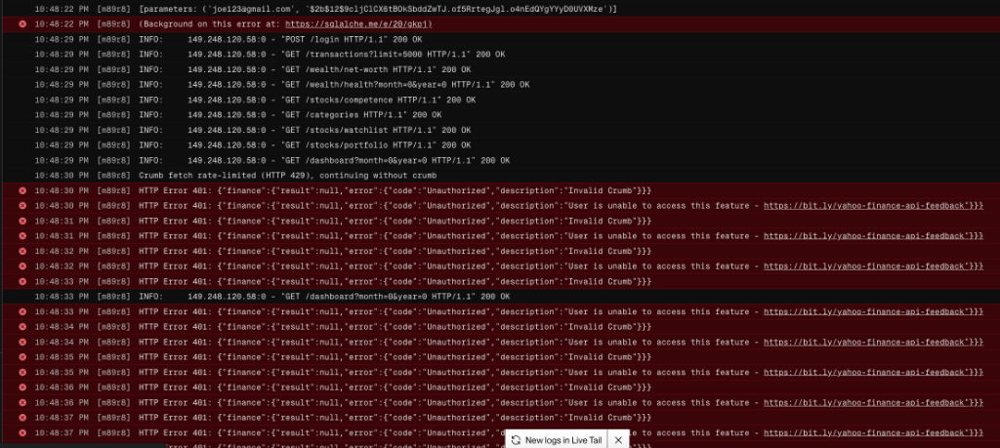
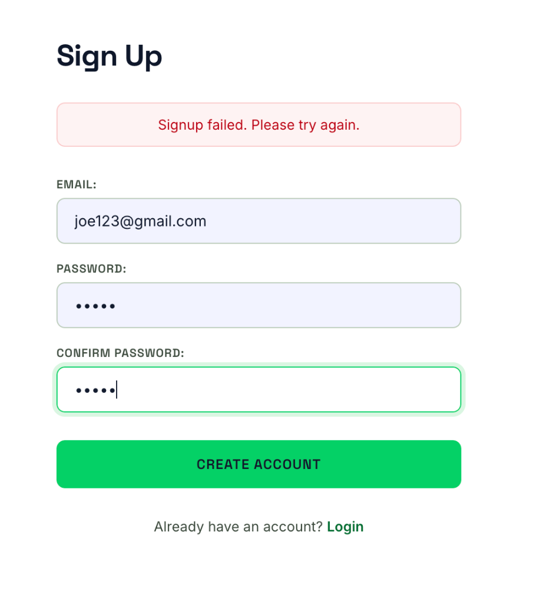
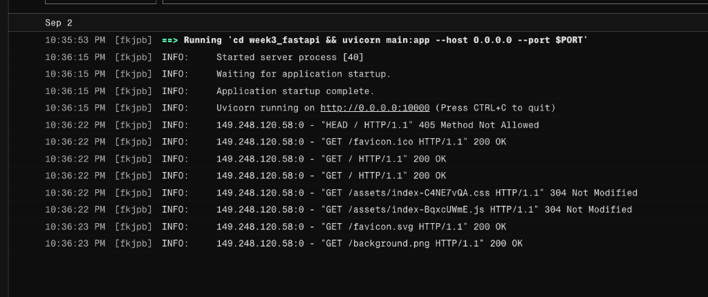
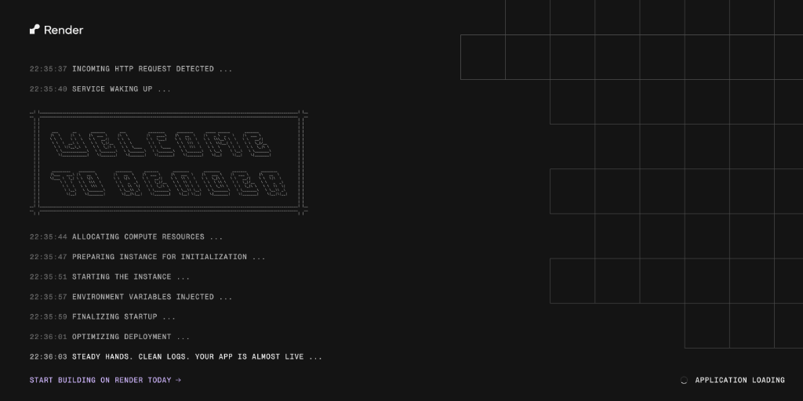
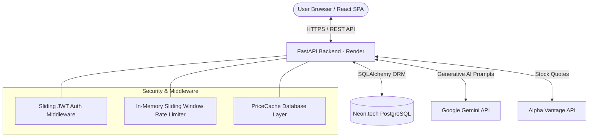

# 💰 Veridian Finance — AI-Powered Wealth & Stock Platform

> 🚀 **Live Production Deployment**: [https://finance-tracker-26i1.onrender.com](https://finance-tracker-26i1.onrender.com)

A full-stack personal finance and wealth management platform built with **React**, **Python (FastAPI)**, **PostgreSQL (Neon.tech)**, and **Google Gemini AI**. Features real-time stock portfolio valuation, category budget tracking, CSV statement deduplication, and an AI Financial Coach with live database context analysis.

---

## 📸 Interface Screenshots & Feature Showcase

### 1. **Cash Flow Dashboard & Interactive Analytics**
> *Aggregated monthly financial overview featuring real-time income ($5,700.00), expenses ($523.12), net savings ($5,176.88), active over-budget warning alerts, and an interactive Recharts category distribution pie chart.*



---

### 2. **Category Budget Management & Progress Caps**
> *Visual budget tracking engine with dynamic color-coded progress indicators (Green < 75%, Orange 75–99%, Red ≥ 100% over-budget threshold) and customizable category management.*



---

### 3. **Paginated Transactions Log & Dynamic Sorting**
> *Full-featured transaction ledger supporting instant category assignment, type tagging (income vs. expense), server-side pagination (10/25/50 rows per page), and item deletion.*



---

### 4. **Bank Statement CSV Import & SHA-256 Deduplication**
> *Batch CSV transaction ingestion pipeline featuring SHA-256 fingerprint deduplication to automatically detect, report, and skip duplicate bank statement entries.*



---

## ✨ Key Features

### 🤖 **AI Financial Coach (Google Gemini API)**
* **Dynamic Context Injection**: Generates targeted financial advice by analyzing live user net worth, income, expenses, category spending, and stock holdings.
* **Resilient Model Failover**: Automatically queries Google's `ListModels` API, excludes deprecated (`2.5`) or specialized (TTS/Audio) models, and iterates candidate models (`gemini-2.0-flash`, `gemini-1.5-pro`) to ensure high availability.
* **Rate Limit Protection**: In-memory sliding-window rate limiter (5 req/min) with a rule-based database fallback engine when Gemini API quotas (15 RPM) are reached.

### 📈 **Stock Portfolio & Equity Screener**
* **Live Market Data**: Integrates Alpha Vantage API for real-time stock lookup, P/E ratios, market cap, and valuation metrics.
* **Database Price Cache**: Implements a `PriceCache` table to reduce external API requests and respect rate limits.
* **Multi-Currency Support**: Automatic CAD/USD exchange rate conversion for international stocks to calculate overall Net Worth in Canadian dollars.

### 📊 **Transaction Management & CSV Deduplication**
* **SHA-256 Deduplication**: Generates cryptographic fingerprints for incoming CSV bank transactions to prevent duplicate imports.
* **Budget Tracking**: Category budgets with visual progress indicators and overspend alerts.
* **Filtering & Pagination**: Search, filter by category/type, and paginate transactions.

### 🔐 **Authentication & Security**
* **Sliding JWT Tokens**: Custom FastAPI middleware issues renewed access tokens (`X-Token-Refresh`) upon activity, keeping active users signed in safely.
* **Password Hashing**: Secure user registration and login using `bcrypt`.
* **Data Isolation**: Strict user-level database scoping across all endpoints.

---

## 🛠️ Tech Stack

| Layer | Technology |
|---|---|
| **Frontend** | React 18, Vite, React Router, Axios, Recharts, Framer Motion |
| **Backend** | Python 3.11, FastAPI, Pydantic, SQLAlchemy ORM, PyJWT, Passlib (bcrypt) |
| **Database** | PostgreSQL (Serverless via Neon.tech) / SQLite fallback |
| **External APIs** | Google Gemini API (Generative Language), Alpha Vantage API |
| **Deployment** | Render (Unified SPA + REST API), Git |

---

## 📁 Project Structure

```text
Finance Project/
├── week3_fastapi/            # Production Backend REST API (Python / FastAPI)
│   ├── main.py               # FastAPI entry point, CORS middleware, static mount
│   ├── database.py           # SQLAlchemy engine & Neon PostgreSQL connection
│   ├── models.py             # Database models (User, Transaction, Holding, Category)
│   ├── auth.py               # JWT token creation, sliding renewal & bcrypt hashing
│   └── routers/              # Modular API endpoints (Auth, AI Chat, Stocks, Wealth)
│
├── week4_react/              # Production Frontend SPA (React 18 / Vite)
│   └── src/
│       ├── api.js            # Axios client with JWT request/response interceptors
│       └── components/       # Dashboard, AI Assistant, Stock Screener, Budgets
│
├── learning_archives/        # Practice modules & exercises (Python, SQL, UI Specs)
├── build.sh                  # Render unified build & deployment script
└── README.md                 # Project documentation & API specifications
```

---

## 🏗️ System Architecture & Data Flow



---

## 🗄️ Database Schema

```
┌──────────────┐       ┌──────────────────┐       ┌──────────────┐
│    users     │       │   transactions   │       │  categories  │
├──────────────┤       ├──────────────────┤       ├──────────────┤
│ id (PK)      │──┐    │ id (PK)          │    ┌──│ id (PK)      │
│ email (UQ)   │  │    │ amount           │    │  │ name         │
│ password_hash│  ├───>│ description      │    │  │ icon         │
└──────────────┘  │    │ date             │    │  │ monthly_budget│
                  │    │ type             │    │  │ user_id (FK) │
                  │    │ user_id (FK)     │    │  └──────────────┘
                  │    │ category_id (FK)─┘
                  │    │ fingerprint (UQ) │
                  │    └──────────────────┘
                  │
                  │    ┌──────────────────┐       ┌──────────────┐
                  │    │     holdings     │       │ price_caches │
                  │    ├──────────────────┤       ├──────────────┤
                  ├───>│ id (PK)          │       │ id (PK)      │
                  │    │ ticker           │       │ ticker (UQ)  │
                  │    │ shares           │       │ price        │
                  │    │ currency         │       │ last_updated │
                  │    │ user_id (FK)     │       └──────────────┘
                  │    └──────────────────┘
                  │
                  │    ┌──────────────────┐
                  │    │  user_profiles   │
                  │    ├──────────────────┤
                  └───>│ user_id (FK)     │
                       │ liabilities      │
                       └──────────────────┘
```

---

## 💡 System Design Highlights

1. **Why Neon PostgreSQL for Production?**
   * Render free tier PostgreSQL instances expire after 90 days. Neon provides a permanent 100% free serverless PostgreSQL database that never pauses or deletes data.
2. **Why Sliding JWT Tokens?**
   * Traditional refresh tokens stored in cookies or local storage introduce CSRF vulnerabilities or complex DB state. Sliding token renewal via response headers (`X-Token-Refresh`) continuously refreshes active sessions securely.
3. **Why In-Memory Database Price Caching?**
   * Free stock market APIs enforce strict rate limits (e.g. 5 requests/min). `PriceCache` caches stock valuations in PostgreSQL, dramatically speeding up dashboard loads and protecting API thresholds.

---

## 💻 Local Development Setup

### 1. Prerequisites
* Python 3.9+
* Node.js 18+

### 2. Backend Setup
```bash
cd week3_fastapi
python3 -m venv venv
source venv/bin/activate
pip install -r requirements.txt
```

Create a `.env` file in `week3_fastapi/.env`:
```env
SECRET_KEY=your_secret_key
ALGORITHM=HS256
ACCESS_TOKEN_EXPIRE_MINUTES=30
GEMINI_API_KEY=your_gemini_api_key
DATABASE_URL=sqlite:///./finance_app.db
```

Run backend server:
```bash
uvicorn main:app --reload
```

### 3. Frontend Setup
```bash
cd week4_react
npm install
npm run dev
```
Open **http://localhost:5173** in your browser.

---

## 📄 License
This project is open-source and built for educational purposes.
